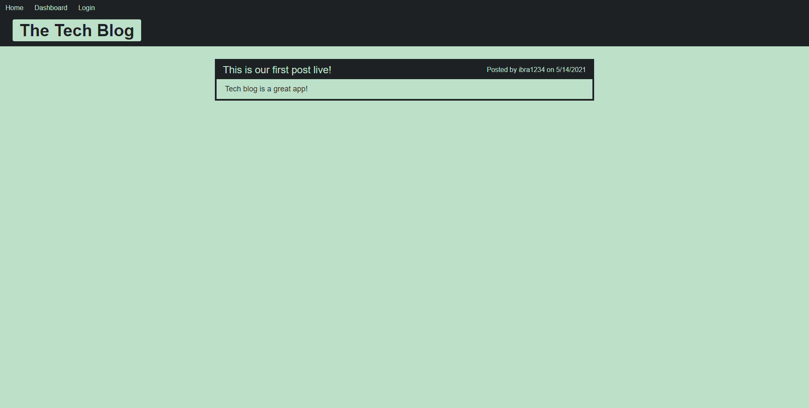

# Tech Blog - Fullstack Application

  

  ## Description
  Tech blog is a full stack web application created it for technologic enthusiastics. The app was created using Node-js and MYSQL data base and different NPM packages like bcrypt, connect-session-sequelize, dotenv, sequelize, express-js, mysql2 and others. The add allows the user to create a user name and password, login, logout, create post, comment on anyones post, edti and delete own posts and more. 

  ## Table of Contents

  * [App-Screenshot](#App-Screenshot)
  * [Installation](#installation)
  * [Usage](#usage)
  * [Contribution](#contribution)
  * [License](#license)
  * [Questions](#questions)

  
  ## App-Screenshot

  

  ## Installation
  To install first make sure you have node.js installed in your computer. Copy the repository and run NPM install on the same directory to install all dependencies in the package.json file. Make sure MYSQL is intalled in your computer to be able to run the aplication. In mysql shelf run file db/schema.sql to create database and the final installation procedure is to create a .env file in your project root folder with content:
  
  DB_NAME='ecommerce_db'
  DB_USER='root'
  DB_PW='Your mysql Passwork'

  Make sure to update the password to match you mysql password. On your computer you can experience the app in your favorite internet browser conecting to http://localhost:3001/

  Online the app is deployed using Huruko.      

  ## Usage
  Run NPM start to start the server first. Open your browser and type http://localhost:3001/

  ## Link to Deployed Application
  https://blog-tech-new.herokuapp.com/

  ## Contribution
  Anybody is free to contribute to this project as desired. Just contact me via email to present your new ideas to add to this project.

  ## License
  This project was done under the MIT license to know more about it, please click here: [MIT](https://choosealicense.com/licenses/mit/)

  ## Questions
  Please visit my GitHub page: https://github.com/hbbc248
  
  For more information please email me at: ibrahimzerlin@hotmail.com

 